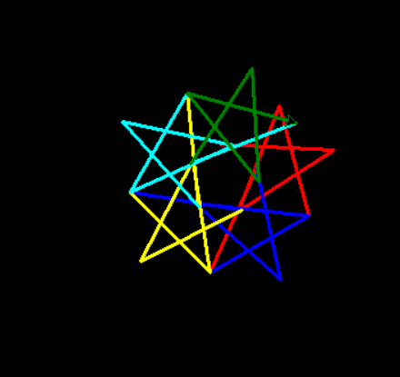

# repo introdoction

---
### This repo is for **Turtle module** examples
Turtle module is **Graphical module** for create any shapes by python 

How many animals in module to create amazing shapes , picture or gif

You can see more options [Turtle module](https://www.geeksforgeeks.org/turtle-programming-python/) in this site